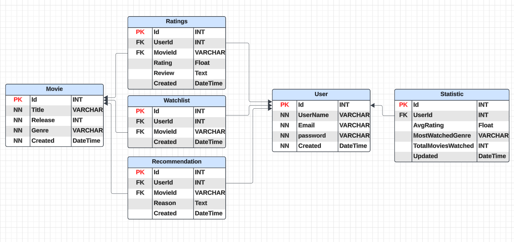

# 🎬 FilmTracker – Agilt Projekt

**FilmTracker** är ett grupprojekt där vi utvecklar en **prototyp av en digital tjänst** inom film- och serietracking.  
Detta är en del av kursens **agila projektledning** där vi arbetar med **Scrum & Kanban**.

---

## 📌 Projektmål
✅ Utveckla en **prototyp** av en film- och serietracker.  
✅ Arbeta enligt **agila metoder** med sprintplanering i **GitHub Projects**.  
✅ Skapa en **interaktiv Figma-prototyp**.  
✅ Presentera vårt arbete genom **Sprint Reviews & Demo**.  

---

## 🏷️ Minimum Viable Product (MVP)
MVP för FilmTracker fokuserar på att leverera en grundläggande, fungerande version av systemet med de mest kritiska funktionerna:
- Skapa och hantera en personlig **watchlist**.
- Spara och betygsätta filmer och serier.
- Visa grundläggande statistik om tittarbeteende.
- Responsiv och intuitiv UI-design i Figma.
- Enkel navigering mellan vyer.

Denna MVP möjliggör en tidig testning av konceptet och kan senare utökas med fler avancerade funktioner.

---

📜 **Presentation i Canva:**  

---

## 🏗️ Sprintplan & Struktur
Projektet delas upp i **fem sprintar**:

| **Sprint** | **Fokus** |
|-----------|----------|
| 🏁 **Sprint 1** | Idégenerering & Kravinsamling (User Stories, User Journeys) |
| 🎨 **Sprint 2** | Design & Planering (Figma-prototyp, systemarkitektur) |
| 🚀 **Sprint 3** | Demonstration & Presentation |
| 🛠️ **Sprint 4** | Backend & Databas (Lagring av användardata, watchlist, betyg) |
| 🎭 **Sprint 5** | Frontend & UI (Implementering av vyer och funktionalitet) |

🔹 **Sprint 4:** Här utvecklas backend-logiken och databasen, inklusive lagring av användardata, watchlist och betyg.  
🔹 **Sprint 5:** Här implementeras UI-komponenter och frontend-funktionalitet, inklusive att visa statistik och rekommendationer.

Vi använder **GitHub Projects** för backlog, sprintplanering och arbetsfördelning.

---

## 📂 Dokumentation
Alla projektfiler och detaljerad dokumentation finns här:

📖 **[Dokumentation](documentaion.md)**  

---

## ⚙️ Teknikval
- **Verktyg:** GitHub Projects, Figma  
- **Metodik:** Scrum + Kanban  
- **Kodning:** Ej relevant i projektet.  

---

## 🎥 Prototyp & Presentation
**🎨 Designprototyp i Figma** 

🎤 **Sprint Reviews & Demo:**  
- **Sprint 1:** Idégenerering & kravinsamling – Vi brainstormade funktioner och skapade user stories.  
- **Sprint 2:** Design & planering – Vi byggde en interaktiv Figma-prototyp och diskuterade systemarkitektur.  
- **Sprint 3:** Demonstration & presentation – Genomgång av prototypen och feedback.  
- **Sprint 4 & 5:** Planerade men ej levererade – För att visa projektets potentiella fortsättning.  

---

## 💡 Team & Roller
- **Scrum Master:** Alla i teamet har testat och diskuterat rollen  
- **Projektledare:** Delat ansvar för planering och beslut  
- **Utvecklare & Designers:** Alla teammedlemmar bidrar till utveckling och design  

Alla i teamet har provat på eller diskuterat de olika rollerna inom Scrum, inklusive **Scrum Master, Produktägare (PO) och Utvecklare**.

---

## 🗄️ Databasstruktur 

---
# Definition of Done (DoD)  

För att en uppgift ska räknas som "Done" i vårt projekt ska följande kriterier vara uppfyllda:  

✅ Koden är skriven och fungerar enligt user story.  
✅ Dokumentation är uppdaterad om relevant.  
✅ Eventuella UI-designs eller prototyper är implementerade och testade.  
✅ Uppgiften har granskats av minst en annan teammedlem.  
✅ Uppgiften är flyttad till "Done" i GitHub Projects.  

---

## 📅 Inlämningskrav
✅ Dokumentation av sprintar på GitHub Repo  
✅ Länk till **GitHub Projects**  
✅ Presentation (Canva + inspelad demo)  
✅ Prototyp i **Figma**  

---

